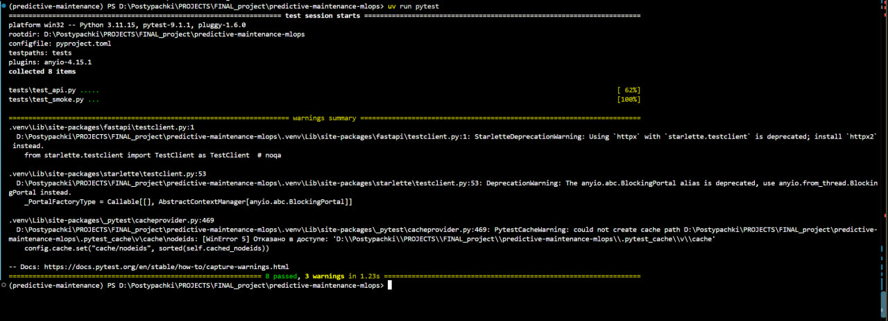
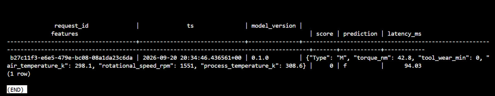
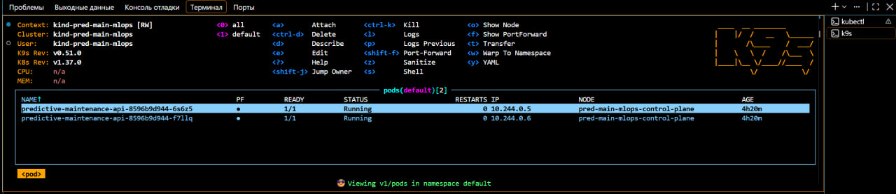
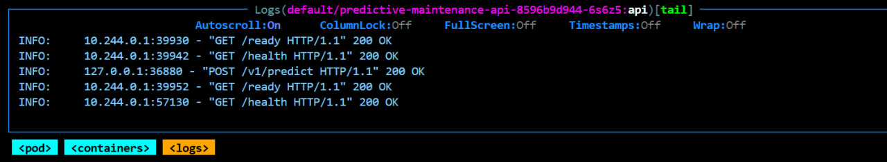
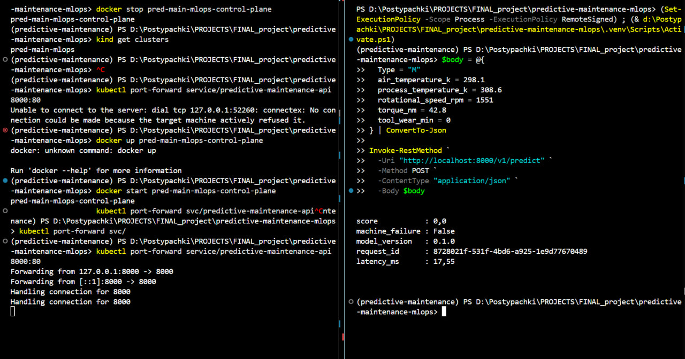

# Report

## Pytest

```text
uv run pytest
```



## PostgreSQL Logs

```sql
SELECT
    request_id,
    ts,
    model_version,
    score,
    prediction,
    latency_ms
FROM predictions
ORDER BY ts DESC
LIMIT 5;
```



## Kubernetes Pods

```text
kubectl get pods
```



## Kubernetes API Logs

```text
POST /v1/predict HTTP/1.1 200 OK
```



## Port Forward Predict

```powershell
kubectl port-forward service/<service-name> 8000:8000
```

```powershell
$body = @{
  Type = "M"
  air_temperature_k = 298.1
  process_temperature_k = 308.6
  rotational_speed_rpm = 1551
  torque_nm = 42.8
  tool_wear_min = 0
} | ConvertTo-Json

Invoke-RestMethod `
  -Uri "http://localhost:8000/v1/predict" `
  -Method POST `
  -ContentType "application/json" `
  -Body $body
```



## Журнал Проблем

- VS Code долго подключался к Jupyter kernel. Решение: выбран интерпретатор проекта `.venv`.
- Notebook сохранял outputs и execution counts. Решение: добавлен pre-commit hook для очистки `.ipynb`.
- FastAPI падал на старте из-за lifespan context manager. Решение: lifespan переведён на async context manager.
- PostgreSQL не сохранял prediction logs из-за ошибки `cannot adapt type 'dict'`. Решение: `features` сохраняются в `jsonb` через `Json(features)`.
